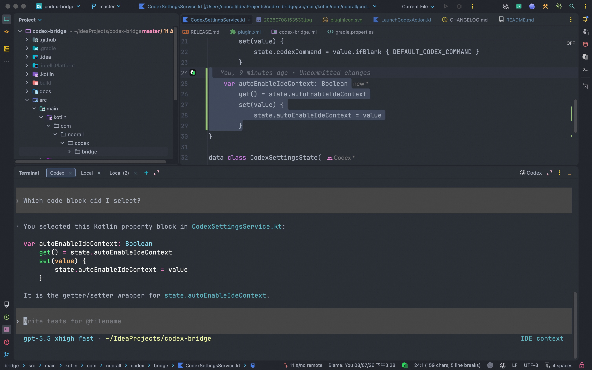

# Codex CLI Bridge

[](https://github.com/noorall/codex-bridge/releases)
[](https://github.com/noorall/codex-bridge/actions/workflows/ci.yml)
[](LICENSE)
[](https://plugins.jetbrains.com/plugin/32805-codex-cli-bridge)
[](build.gradle.kts)
[](build.gradle.kts)

Codex CLI Bridge is a JetBrains IDE plugin that starts Codex CLI and provides project-specific editor context to Codex `/ide`.

The plugin keeps Codex CLI as the agent host in the terminal. JetBrains provides context for each project's active file, selection ranges, selected text, and open tabs. It does not use ACP or MCP, and it does not make the IDE host the agent.

## Screenshot



## What It Sends

- active file path and absolute `fsPath`
- primary selection range
- selected text, capped at 40,000 characters to match Codex prompt rendering
- multiple selection ranges when the editor has multiple selected carets
- open editor tabs

While the Codex terminal session is running, the IDE status bar shows the current selected file and line range. Click it to inspect the selected code, active file, open tabs, and the time Codex last requested the context. Selecting another range replaces the displayed range, and closing Codex removes the widget.

## Build

Open the project as a Gradle project in IntelliJ IDEA and run:

```bash
gradle buildPlugin
```

This repository does not currently include a Gradle wrapper. If you generate one, use a Gradle version compatible with the IntelliJ Platform Gradle Plugin configured in `build.gradle.kts`.

## Checks

CI runs the Gradle `check` task before building the plugin. That includes Kotlin formatting and Apache RAT license checks for Kotlin source files.

```bash
gradle check
```

Use Spotless to apply local formatting fixes:

```bash
gradle spotlessApply
```

## Try It

1. Install/run the plugin in a JetBrains IDE.
2. Open the same project in the IDE.
3. Configure `Settings | Tools | Codex CLI Bridge` if `codex` is not the command you want, or if you want to turn automatic IDE context on or off.
4. Click the Codex toolbar icon or use `Tools | Start Codex`.
5. Send a prompt.

The plugin enables `/ide` automatically after Codex is ready. It watches the terminal for the Codex prompt, then sends `/ide on`. You can turn this off in `Settings | Tools | Codex CLI Bridge`.

Codex will fetch fresh IDE context immediately before the outgoing prompt.

## License

Apache License 2.0. See [LICENSE](LICENSE).
